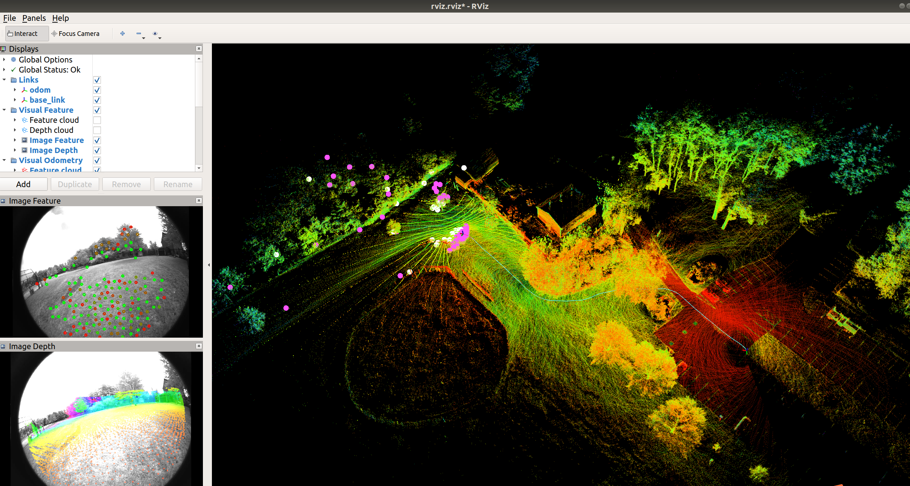
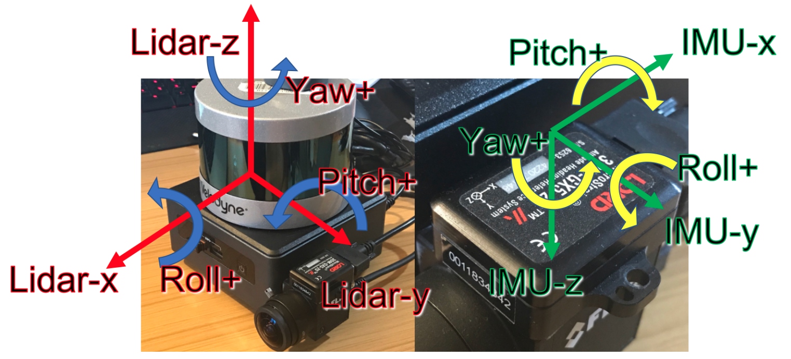
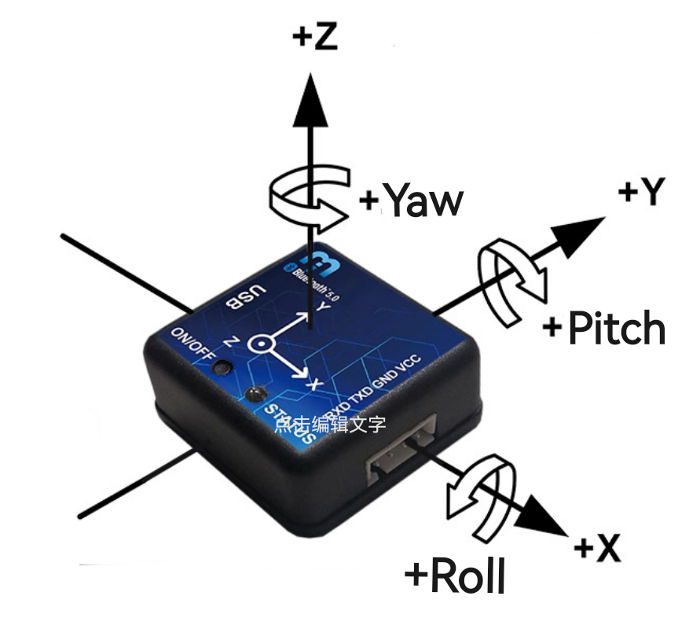
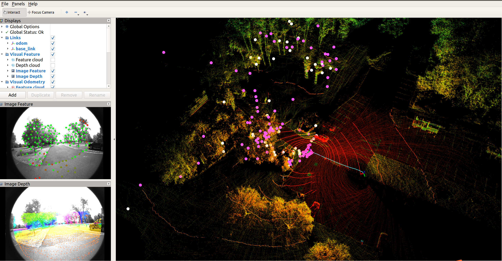
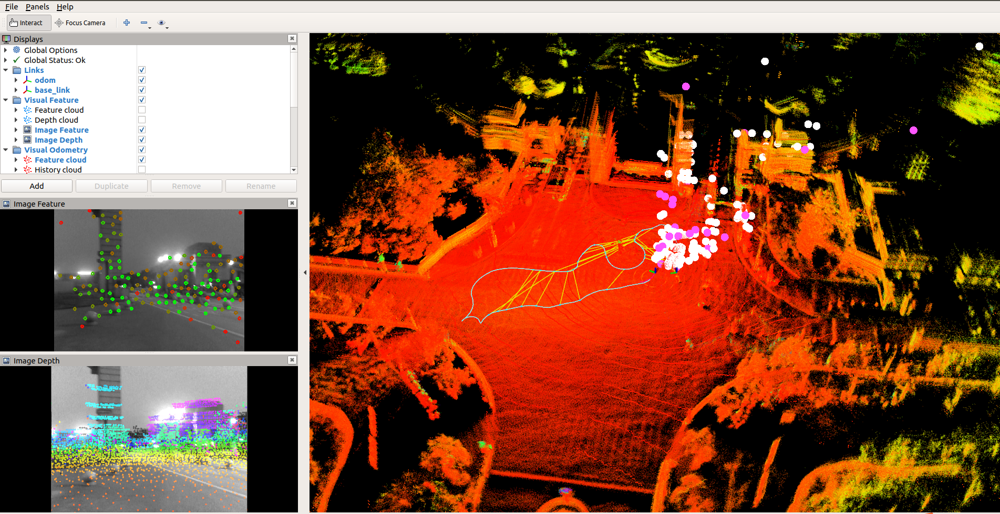
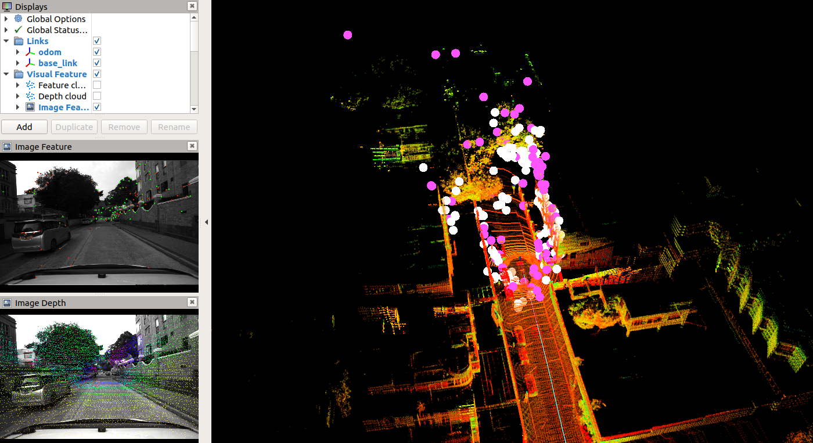
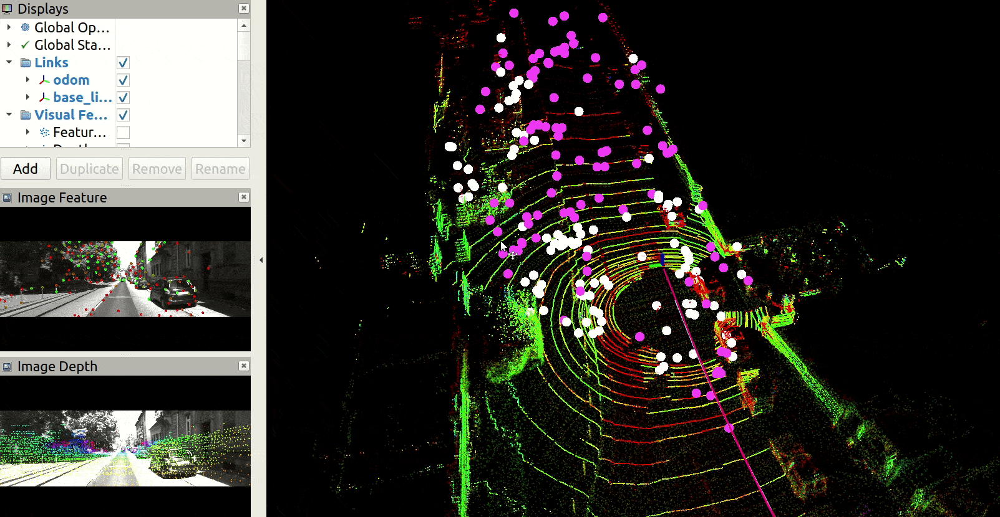
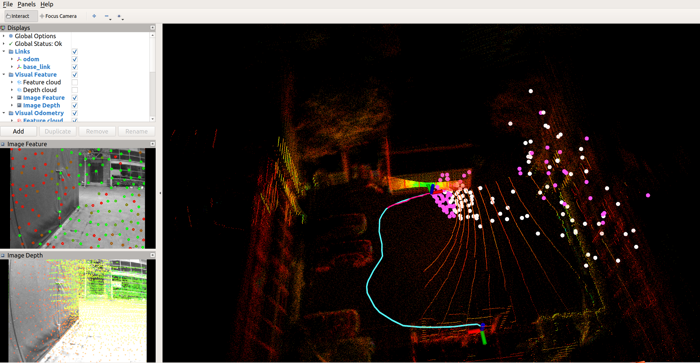
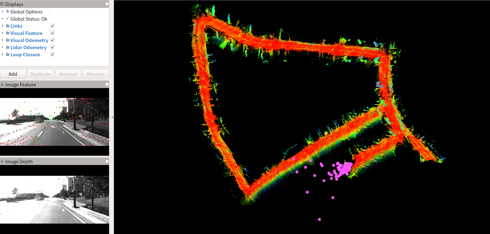
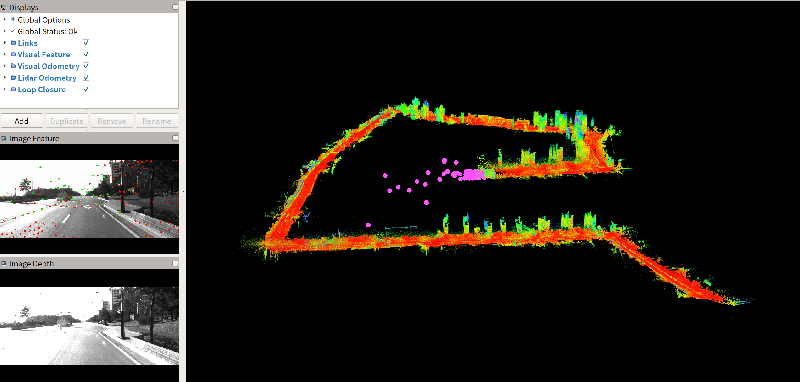

# LVI-SAM-Easyused（[中文README](./README_CN.md)）

This repository contains the modified code of [LVI-SAM](https://github.com/TixiaoShan/LVI-SAM) for easier using, which mainly solves the problem of ambiguous extrinsic configuration of the original LVI-SAM. Using this code, you only need to configure the extrinsic between LiDAR and IMU (**T_imu_lidar**), the extrinsic between Camera and IMU (**T_imu_camera**), and the properties of the IMU itself (**which axis the IMU rotates around counterclockwise to get a positive Euler angle output**), and then you can run LVI-SAM on different devices.

The test video on many datasets is available on **YouTube** (click below images to open) and [**Bilibili**](https://www.bilibili.com/video/BV1jv4y1Q7zr/?vd_source=1363e3b30e51ca9984f82492949f865b).

<div align="center">
<a href="https://youtu.be/kty_oOBuyCY" target="_blank"></a>
</div>

---


### Update

- The "**new**" branch is avaliable. We **recommend you to use the "new" branch**, because the LiDAR-Inertial system in the original LVI-SAM code repo uses an old version of [LIO-SAM](https://github.com/TixiaoShan/LIO-SAM) with some bugs, which have been fixed in the latest LIO-SAM code repo. At present, we have updated the latest version of LIO-SAM into LVI-SAM, so the system is more robust. You can use the following commands to download and compile the "**new**" branch.

  ```shell
  mkdir -p ~/catkin_ws/src 
  cd ~/catkin_ws/src
  git clone https://github.com/Cc19245/LVI-SAM-Easyused
  git checkout new
  cd ..
  catkin_make
  ```


---


## Dependency

The dependency of this repo is **same** as the official [LVI-SAM](https://github.com/TixiaoShan/LVI-SAM). So if you occur a compile problem, we recommend you to compile the official [LVI-SAM](https://github.com/TixiaoShan/LVI-SAM) firstly. Right now we have only tested on Ubuntu 18.04 + ROS-melodic environment.

---


## Compile

You can use the following commands to download and compile the package.

```shell
mkdir -p ~/catkin_ws/src
cd ~/catkin_ws/src
git clone https://github.com/Cc19245/LVI-SAM-Easyused
cd ..
catkin_make
```

**Note**：If you want to use the no-modified code (origin LVI-SAM official code), you can change the defination in `CMakeLists.txt` and compile again.

```cmake
################## 编译开关 compile switch##############
# -DIF_OFFICIAL=1: use origin official LVI-SAM code
# -DIF_OFFICIAL=0: use modified code of this repo
add_definitions(-DIF_OFFICIAL=0)
```

---


## Params config

### Sensors extrinsic config

1. `params_camera.yaml`: set the VIO params, especially for **T_imu\_camera**, which is the camera pose represented in IMU frame. It's same as VINS-Mono.

```yaml
###################### extrinsic between IMU and Camera  ###########################
###################### T_IMU_Camera, Camera -> IMU       ###########################  
# R_imu_camera
extrinsicRotation: !!opencv-matrix
   rows: 3
   cols: 3
   dt: d
   data: [ 0,    0,    -1, 
               -1,     0,    0, 
                0,     1,    0]
# t_imu_camera
extrinsicTranslation: !!opencv-matrix
   rows: 3
   cols: 1
   dt: d
   data: [0.006422381632411965, 0.019939800449065116, 0.03364235163589248]
```

2. `params_lidar.yaml`: set the LIO params, especially for **T_imu_lidar**, which is the lidar pose represented in IMU frame.

```yaml
  ###################### extrinsic between IMU and LiDAR  ###########################
  ###################### T_IMU_LiDAR, LiDAR -> IMU       ############################
  # t_imu_lidar
  extrinsicTranslation: [0.0,   0.0,   0.0]    
  # R_imu_lidar
  extrinsicRotation: [-1,   0,    0, 
                                         0,    1,    0, 
                                         0,    0,   -1]
```

### IMU property config
(**Note**: This is only the property of the IMU itself and has no relationship with its installation.)

Due to the special IMU (the Euler angle coordinate system is different from the acceleration and angular velocity coordinate system) of official dataset , you also need to set which axis the IMU rotates around counterclockwise to get a positive Euler angle output. For official sensor equipment, it is set as follows.

```yaml
  ## 对绝大多数IMU来说，下面三个值分别是"+z", "+y", "+x" (for most of IMUs, the following config is "+z", "+y", "+x")
  # 绕着哪个轴逆时针转动，输出yaw角度为正(which axis the IMU rotates around counterclockwise to get a positive yaw angle)
  yawAxis: "-z"  
  # 绕着哪个轴逆时针转动，输出pitch角度为正(which axis the IMU rotates around counterclockwise to get a positive pitch angle)
  pitchAxis: "+x"    
  # 绕着哪个轴逆时针转动，输出roll角度为正(which axis the IMU rotates around counterclockwise to get a positive roll angle)
  rollAxis: "+y"    
```

<p align='center'>
    
</p>


**For most of the IMUs, the Euler angle coordinate system is same as the acceleration and angular velocity coordinate system**. So the above parameters should be set as follows.

```yaml
  ## 对绝大多数IMU来说，下面三个值分别是"+z", "+y", "+x" (for most of IMUs, the following config is "+z", "+y", "+x")
  # 绕着哪个轴逆时针转动，输出yaw角度为正(which axis the IMU rotates around counterclockwise to get a positive yaw angle)
  yawAxis: "+z"  
  # 绕着哪个轴逆时针转动，输出pitch角度为正(which axis the IMU rotates around counterclockwise to get a positive pitch angle)
  pitchAxis: "+y"    
  # 绕着哪个轴逆时针转动，输出roll角度为正(which axis the IMU rotates around counterclockwise to get a positive roll angle)
  rollAxis: "+x"    
```
<p align='center'>
    
</p>


---


## Run the package on different datasets

1. [Official dataset](https://drive.google.com/drive/folders/1q2NZnsgNmezFemoxhHnrDnp1JV_bqrgV)

   - Run the launch file:

     ```
     roslaunch lvi_sam run.launch
     ```

     **Note**: If you want to test the origin official LVI-SAM code (e.g. set `add_definitions(-DIF_OFFICIAL=1)` in CMakeLists.txt to compile), you should run launch file as following.

     ```
     roslaunch lvi_sam run_official.launch
     ```

   - Play existing bag files, e.g. handheld.bag:

     ```
     rosbag play handheld.bag 
     ```

   - Results of origin official code (up fig) and our modified code (down fig) on handheld.bag:

     <p align='center'>
         
     </p>
      
     
     <p align='center'>
         
     </p>

2. [M2DGR dataset](https://github.com/SJTU-ViSYS/M2DGR)

   - Run the launch file:

     ```
     roslaunch lvi_sam M2DGR.launch
     ```

   - Play existing bag files, e.g. gate_01.bag:

     ```
     rosbag play gate_01.bag 
     ```

   - Results of our modified code on gate_01.bag:

     <p align='center'>
         
     </p>

3. [UrbanNavDataset](https://github.com/weisongwen/UrbanNavDataset)

   - Run the launch file:

     ```
     roslaunch lvi_sam UrbanNavDataset.launch
     ```

   - Play existing bag files, the params we provided is for [UrbanNav-HK-Data20200314](https://www.dropbox.com/s/3mtlncglrv7p39l/2020-03-14-16-45-35.bag.tar.gz?dl=0). If you use other bag files of UrbanNavDataset, please check if the params need to be changed.

     ```
     rosbag play 2020-03-14-16-45-35.bag 
     ```

   - Results on UrbanNav-HK-Data20200314:

     <p align='center'>    </p>

3. [KITTI raw dataset](https://www.cvlibs.net/datasets/kitti/raw_data.php)

   - Run the launch file:

     ```
     roslaunch lvi_sam KITTI.launch
     ```

   - Play existing bag files. Please note that you must use **KITTI raw dataset** rather than KITTI Odometry dataset, because the latter's IMU frequency is too low. If you want to use KITTI raw dataset for LVI-SAM, you need to get rosbag files firstly. You can get it refer to [LIO-SAM/config/doc/kitti2bag](https://github.com/TixiaoShan/LIO-SAM/tree/master/config/doc/kitti2bag). Here we use KITTI_2011_09_26_drive_0084_synced raw data to get rosbag file. The transformed rosbag file can get at [this link](https://1drv.ms/u/s!AqYajE_ft9lwg0tuhqyZqd4MUjqp?e=hnvkZo).

     ```
     rosbag play kitti_2011_09_26_drive_0084_synced.bag  
     ```

   - Results of our modified code on kitti_2011_09_26_drive_0084_synced.bag:

     <p align='center'>
         
     </p>

3. [My test dataset](https://1drv.ms/u/s!AqYajE_ft9lwg0paJQu_DRzU-GQ5?e=A95yfn)

   - Run the launch file:

     ```
     roslaunch lvi_sam backbag.launch
     ```

   - Play existing bag files, e.g. backbag.bag:

     ```
     rosbag play backbag.bag 
     ```

   - Results of our modified code on backbag.bag:

     <p align='center'>
         
     </p>

   - Results of our modified code on our own 0117-1525.bag (Device is different from backbag.bag, so it has another params. However, sorry for privacy issues, this data package can not open source):

     ```
     roslaunch lvi_sam ljj.launch
     rosbag play 0117-1525.bag 
     ```

     <p align='center'>    </p>
   
6. [KAIST Complex Urban Dataset](https://sites.google.com/view/complex-urban-dataset) 

   See TODO.

---


## TODO

  - [x] ~~More test on different dataset, e.g. [KAIST Complex Urban Dataset](https://sites.google.com/view/complex-urban-dataset). **However**, these datasets' lidar data have no **ring** information. So LVI-SAM can't run directly. If you want to run on these datasets, you need to modifidy the code to add this information refer to [LeGO-LOAM](https://github.com/RobustFieldAutonomyLab/LeGO-LOAM).~~

- We have test  [KAIST Complex Urban Dataset](https://sites.google.com/view/complex-urban-dataset) on "**new**" branch. We mainly made two changes:

  - We updated the latest version of LIO-SAM repo code into LVI-SAM, so the system is more robust and can run on KAIST Complex Urban Dataset successfully.
  - We generate rosbag from the origin KAIST Complex Urban Dataset, and recover the `ring`and `time` field of LiDAR pointcloud. You can using the ros package in [doc/kaise-help](./doc/kaist-help) to generate rosbags.

- Test on  KAIST Complex Urban Dataset urban26 sequence.

  - Run the launch file:

    ```
    roslaunch lvi_sam KAIST.launch
    ```

  - Play the generated bag files, e.g. urban26.bag:

    ```
    rosbag play urban26.bag 
    ```

  - Results of our modified code on urban26.bag:

    <p align='center'>    </p>

    <p align='center'>    </p>

    We can see that the trajectory has a large drift, and the loop closure doesn't be detected successfully. This may be due to the reason that the LiDAR of KAIST dataset is installed obliquely, resulting in too few valid pointclouds for registration.

---


## Notes

- This code just modified the  extrinsic config of LVI-SAM for easier using. Its purpose is to allow you to adapt to other datasets and your own devices faster. So it does **NOT** modify the algorithm part of LVI-SAM.
- If you want to know what changes I made and why they make sense, you can refer to my blog: [LVI-SAM坐标系外参分析与代码修改，以适配各种数据集](https://blog.csdn.net/qq_42731705/article/details/128344179).
- I made a Chinese comments of LVI-SAM's code at [LVI-SAM-CC_Comments](https://github.com/Cc19245/LVI-SAM-CC_Comments).
---


## Acknowledgement

- Origin official [LVI-SAM](https://github.com/TixiaoShan/LVI-SAM).
