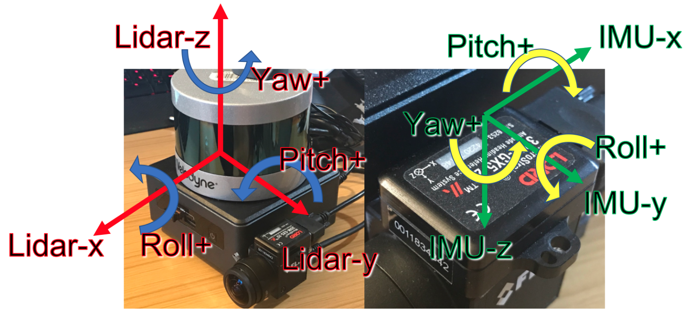
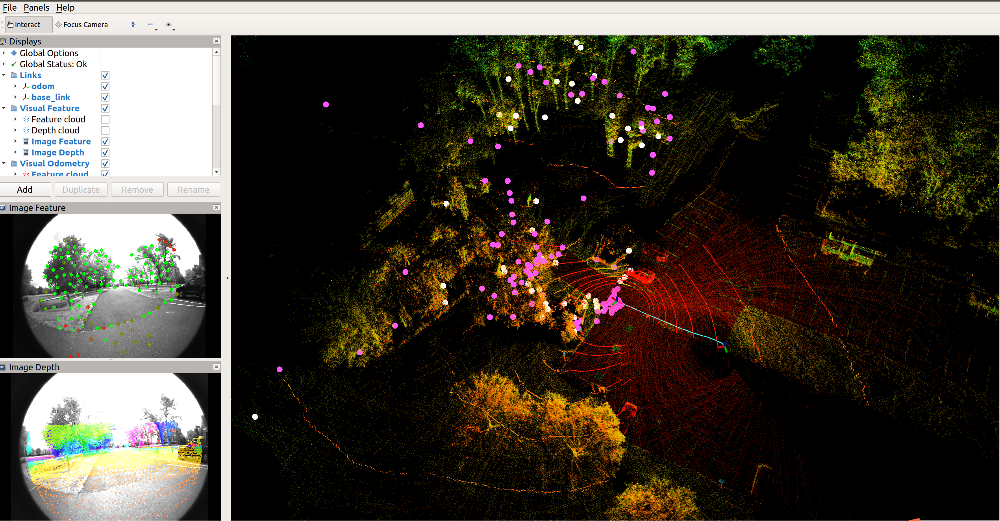
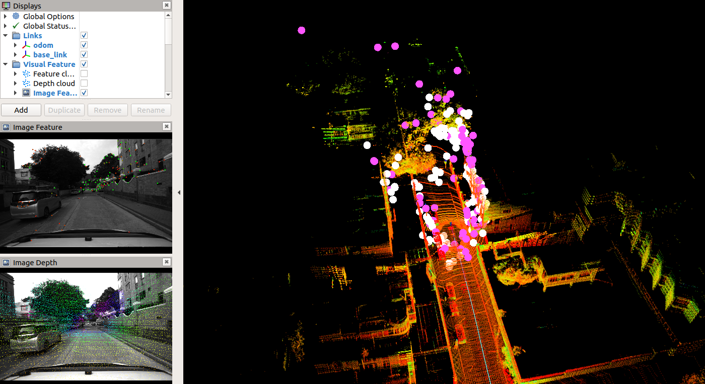
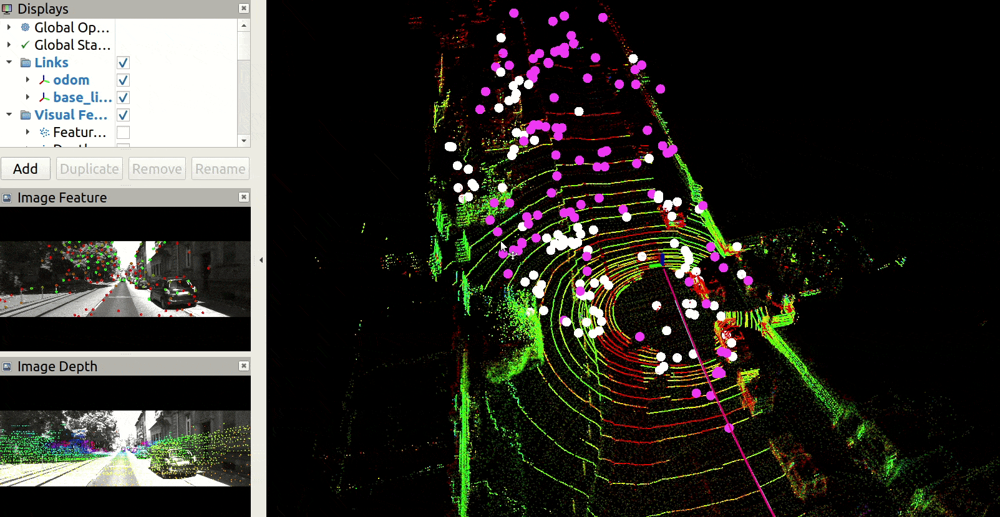
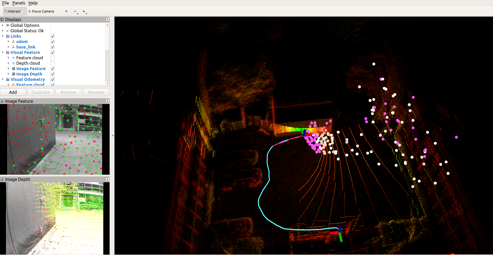
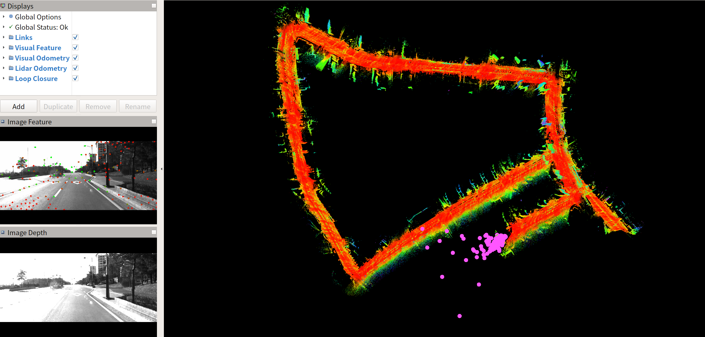
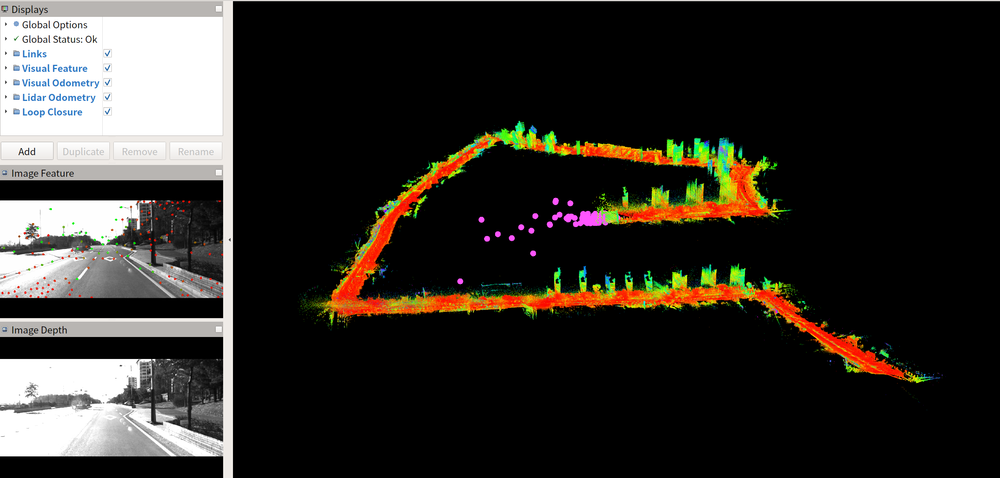

# LVI-SAM-Easyused

本仓库包含 [LVI-SAM](https://github.com/TixiaoShan/LVI-SAM) 的修改代码以便于使用，目的是解决原始的 LVI-SAM 外参配置混乱的问题。使用这份代码，你只需要配置 LiDAR 和 IMU 之间的外参 （**T_imu_lidar**）、Camera 和 IMU 之间的外参 （**T_imu_camera**），以及 IMU 本身的属性 （**绕着哪个坐标轴逆时针旋转输出正的欧拉角**），然后你就可以在不同的设备上运行 LVI-SAM 。

许多数据集的测试视频可以在 **YouTube**（点击下面的图片打开）和 [**Bilibili**](https://www.bilibili.com/video/BV1jv4y1Q7zr/?vd_source=1363e3b30e51ca9984f82492949f865b) 上找到。

<div align="center">
<a href="https://youtu.be/kty_oOBuyCY" target="_blank"></a>
</div>

---


### 更新

- **"new"分支**可用了，我们**建议您使用"new"分支**。因为原始 LVI-SAM 代码中的 LIO 系统使用了旧版本的 [LIO-SAM](https://github.com/TixiaoShan/LIO-SAM)，其中存在一些 bug，这些 bug 已在最新的 LIO-SAM 代码中修复。目前，我们已经将最新版本的 LIO-SAM 更新到 LVI-SAM 中，因此系统更加鲁棒。您可以使用以下命令下载并编译 **"new"分支**。

  ```shell
  mkdir -p ~/catkin_ws/src 
  cd ~/catkin_ws/src
  git clone https://github.com/Cc19245/LVI-SAM-Easyused
  git checkout new
  cd ..
  catkin_make
  ```


---


## 依赖库

这个仓库的依赖库与官方 [LVI-SAM](https://github.com/TixiaoShan/LVI-SAM) 相同。所以如果编译出现问题，建议先编译官方的 [LVI-SAM](https://github.com/TixiaoShan/LVI-SAM)。目前我们只在 Ubuntu 18.04 + ROS-melodic 环境中进行了测试。

---


## 编译

你可以使用如下命令下载并编译这个功能包。

```shell
mkdir -p ~/catkin_ws/src
cd ~/catkin_ws/src
git clone https://github.com/Cc19245/LVI-SAM-Easyused
cd ..
catkin_make
```

**注意**：如果想使用未修改的代码（LVI-SAM官方代码），可以修改 `CMakeLists.txt` 中的定义，重新编译。

```cmake
################## 编译开关 compile switch##############
# -DIF_OFFICIAL=1: use origin official LVI-SAM code
# -DIF_OFFICIAL=0: use modified code of this repo
add_definitions(-DIF_OFFICIAL=0)
```

---


## 参数配置

### 传感器外参配置

1. `params_camera.yaml`: 设置 VIO 外参，尤其是 **T_imu\_camera**，它是 Camera 位姿在 IMU 坐标系下的表示。它和 VINS-Mono 是一样的。

```yaml
###################### extrinsic between IMU and Camera  ###########################
###################### T_IMU_Camera, Camera -> IMU       ###########################  
# R_imu_camera
extrinsicRotation: !!opencv-matrix
   rows: 3
   cols: 3
   dt: d
   data: [ 0,    0,    -1, 
               -1,     0,    0, 
                0,     1,    0]
# t_imu_camera
extrinsicTranslation: !!opencv-matrix
   rows: 3
   cols: 1
   dt: d
   data: [0.006422381632411965, 0.019939800449065116, 0.03364235163589248]
```

2. `params_lidar.yaml`: 设置 LIO 外参，尤其是 **T_imu_lidar**，它是 LiDAR 位姿在 IMU 坐标系下的表示。

```yaml
  ###################### extrinsic between IMU and LiDAR  ###########################
  ###################### T_IMU_LiDAR, LiDAR -> IMU       ############################
  # t_imu_lidar
  extrinsicTranslation: [0.0,   0.0,   0.0]    
  # R_imu_lidar
  extrinsicRotation: [-1,   0,    0, 
                                         0,    1,    0, 
                                         0,    0,   -1]
```

### IMU property config
（**注意**: 这是 IMU 本身的属性，和它的安装方式没有关系。）

由于官方数据集的 IMU 比较特殊（欧拉角坐标系不同于加速度、角速度坐标系），所以还需要设置 IMU 绕哪个轴 **逆时针** 旋转得到 **正** 的欧拉角。 对于官方的传感器设备，设置如下。

```yaml
  ## 对绝大多数IMU来说，下面三个值分别是"+z", "+y", "+x" (for most of IMUs, the following config is "+z", "+y", "+x")
  # 绕着哪个轴逆时针转动，输出yaw角度为正(which axis the IMU rotates around counterclockwise to get a positive yaw angle)
  yawAxis: "-z"  
  # 绕着哪个轴逆时针转动，输出pitch角度为正(which axis the IMU rotates around counterclockwise to get a positive pitch angle)
  pitchAxis: "+x"    
  # 绕着哪个轴逆时针转动，输出roll角度为正(which axis the IMU rotates around counterclockwise to get a positive roll angle)
  rollAxis: "+y"    
```

<p align='center'>
    
</p>


**对于大多数 IMU，欧拉角坐标系与加速度、角速度坐标系相同**。 所以上面的参数应该设置如下。

```yaml
  ## 对绝大多数IMU来说，下面三个值分别是"+z", "+y", "+x" (for most of IMUs, the following config is "+z", "+y", "+x")
  # 绕着哪个轴逆时针转动，输出yaw角度为正(which axis the IMU rotates around counterclockwise to get a positive yaw angle)
  yawAxis: "+z"  
  # 绕着哪个轴逆时针转动，输出pitch角度为正(which axis the IMU rotates around counterclockwise to get a positive pitch angle)
  pitchAxis: "+y"    
  # 绕着哪个轴逆时针转动，输出roll角度为正(which axis the IMU rotates around counterclockwise to get a positive roll angle)
  rollAxis: "+x"    
```
<p align='center'>
    
</p>


---


## 在不同数据集上运行功能包

1. [LVI-SAM 官方数据集](https://drive.google.com/drive/folders/1q2NZnsgNmezFemoxhHnrDnp1JV_bqrgV)

   - 运行 launch 文件:

     ```
     roslaunch lvi_sam run.launch
     ```

     **注意**: 如果你想测试原始官方 LVI-SAM 代码（例如在 CMakeLists.txt 中设置 add_definitions(-DIF_OFFICIAL=1) 来编译），你应该运行 launch 文件如下。

     ```
     roslaunch lvi_sam run_official.launch
     ```

   - 播放数据包，例如 handheld.bag:

     ```
     rosbag play handheld.bag 
     ```

   - 原始官方代码（上图）和我们修改后的代码（下图）在 handheld.bag 上的运行结果：

     <p align='center'>
         
     </p>
      
     
     <p align='center'>
         
     </p>

2. [M2DGR Dataset](https://github.com/SJTU-ViSYS/M2DGR)

   - 运行 launch 文件:

     ```
     roslaunch lvi_sam M2DGR.launch
     ```

   - 播放数据包，例如 gate_01.bag:

     ```
     rosbag play gate_01.bag 
     ```

   - 我们修改后的代码在 gate_01.bag 上的运行结果:

     <p align='center'>
         
     </p>

3. [UrbanNavDataset](https://github.com/weisongwen/UrbanNavDataset)

   - 运行 launch 文件:

     ```
     roslaunch lvi_sam UrbanNavDataset.launch
     ```

   - 播放数据包。我们提供的参数是 [UrbanNav-HK-Data20200314](https://www.dropbox.com/s/3mtlncglrv7p39l/2020-03-14-16-45-35.bag.tar.gz?dl=0) 的参数，如果你使用 UrbanNavDataset 的其他数据包，请检查配置参数是否需要改动。

     ```
     rosbag play 2020-03-14-16-45-35.bag 
     ```

   - 我们修改后的代码在 UrbanNav-HK-Data20200314 上的结果：

     <p align='center'>    </p>

3. [KITTI raw dataset](https://www.cvlibs.net/datasets/kitti/raw_data.php)

   - 运行 launch 文件:

     ```
     roslaunch lvi_sam KITTI.launch
     ```

   - 播放数据包。注意你必须使用 **KITTI raw dataset** 而不是 KITTI Odometry dataset，因为后者的 IMU 数据是经过处理的，频率太低了。如果你想使用 KITTI raw dataset，你首先需要把它转成 rosbag。 你可以参考 [LIO-SAM/config/doc/kitti2bag](https://github.com/TixiaoShan/LIO-SAM/tree/master/config/doc/kitti2bag) 进行操作。这里我们使用 KITTI_2011_09_26_drive_0084_synced 原始数据转化得到 rosbag。转化后的数据包可以在 [这个链接](https://1drv.ms/u/s!AqYajE_ft9lwg0tuhqyZqd4MUjqp?e=hnvkZo) 下载。

     ```
     rosbag play kitti_2011_09_26_drive_0084_synced.bag  
     ```

   - 我们修改后的代码在 kitti_2011_09_26_drive_0084_synced.bag 上的运行结果：

     <p align='center'>
         
     </p>

3. [我自己的测试数据](https://1drv.ms/u/s!AqYajE_ft9lwg0paJQu_DRzU-GQ5?e=A95yfn)

   - 运行 launch 文件:

     ```
     roslaunch lvi_sam backbag.launch
     ```

   - 播放数据包，例如 backbag.bag:

     ```
     rosbag play backbag.bag 
     ```

   - 我们修改后的代码在 backbag.bag 上的运行结果：

     <p align='center'>
         
     </p>

   - 我们修改后的代码在 0117-1525.bag 上的运行结果（这个数据包的设备不同于 backbag.bag，所以它的参数配置和 backbag.bag 也不一样。由于隐私问题，这个数据包不能开源，请见谅）：

     ```
     roslaunch lvi_sam ljj.launch
     rosbag play 0117-1525.bag 
     ```

     <p align='center'>    </p>
   
6. [KAIST Complex Urban Dataset](https://sites.google.com/view/complex-urban-dataset) 

   参见 TODO.

---


## TODO

  - [x] ~~对不同数据集进行更多测试，例如 [KAIST Complex Urban Dataset](https://sites.google.com/view/complex-urban-dataset)。 **但是**，这些数据集的激光雷达数据没有**ring**信息，所以LVI-SAM不能直接运行。 如果要在这些数据集上运行，需要修改代码添加此信息参考[LeGO-LOAM](https://github.com/RobustFieldAutonomyLab/LeGO-LOAM)~~

- 我们在“**new**”分支上测试了[KAIST Complex Urban Dataset](https://sites.google.com/view/complex-urban-dataset)。 我们主要做了两个改动：

  - 我们将最新版本的 LIO-SAM repo 代码更新为 LVI-SAM，因此系统更加健壮，可以在 KAIST Complex Urban Dataset 上成功运行。
  - 我们从原始的 KAIST Complex Urban Dataset 生成 rosbag，并恢复 LiDAR 点云的 “ring” 和 “time” 字段。 您可以使用[doc/kaise-help](./doc/kaist-help) 中的 ros 包来生成 rosbag。

- 在  KAIST Complex Urban Dataset urban26 序列上测试：

  - 运行 launch 文件:

    ```
    roslaunch lvi_sam KAIST.launch
    ```

  - 播放生成的 rosbag，例如 urban26.bag:

    ```
    rosbag play urban26.bag 
    ```

  - 我们修改后的代码在 urban26.bag 上的运行结果：

    <p align='center'>    </p>

    <p align='center'>    </p>

    可以看到轨迹有很大的漂移，没有成功检测到闭环。 这可能是由于 KAIST 数据集的 LiDAR 倾斜安装的原因，导致配准的有效点云太少。

---


## 注意

- 此代码只是修改了 LVI-SAM 的外参配置以便于使用，它的目的是让你更快地在其他数据集和你自己的设备上运行 LVI-SAM，所以它 **没有** 修改 LVI-SAM 的算法部分。
- 如果你想知道我做了哪些改动以及为什么这些改动有效，你可以参考我的博客：[LVI-SAM坐标系外参分析与代码修改，以适配各种数据集](https://blog .csdn.net/qq_42731705/article/details/128344179)。
- 我对 LVI-SAM 代码做了中文注释，仓库参见 [LVI-SAM-CC_Comments](https://github.com/Cc19245/LVI-SAM-CC_Comments) 。
---


## Acknowledgement

- 原始的官方 [LVI-SAM](https://github.com/TixiaoShan/LVI-SAM) 
